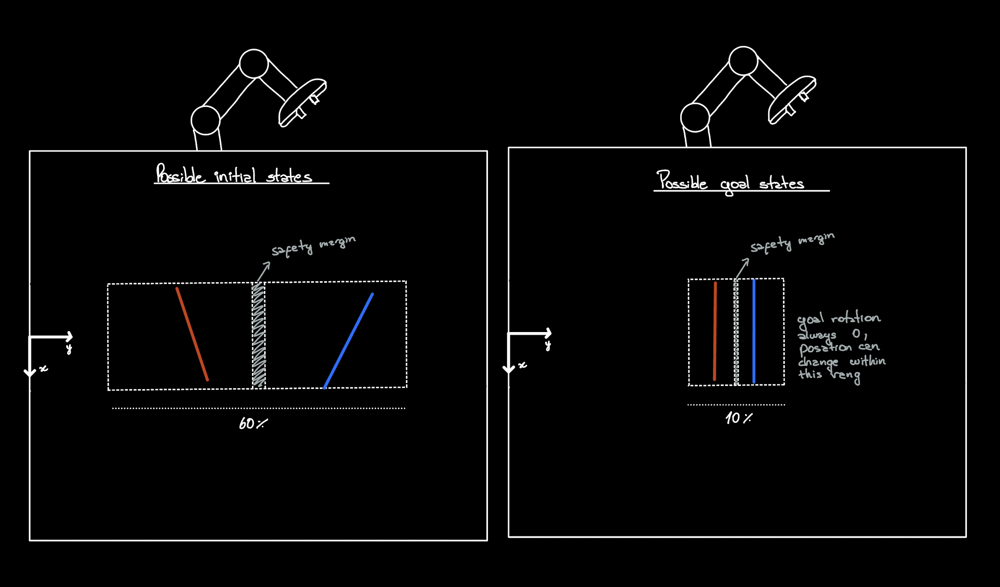

# N=2 Side-Specific Task

This document records the task-design decisions for the first `num_sticks=2`
behavior-cloning dataset.

## Coordinate Convention

World axes follow the MuJoCo / robosuite convention observed in the renderer:

- `X`: vertical direction in the top-down table view.
- `Y`: horizontal left/right direction in the top-down table view.
- `Z`: height above the table.

The stick long axis is its local `X` axis. `goal_yaw = 0.0` means the desired
stick orientation is aligned with world `X`, modulo the stick's 180-degree
symmetry.

## Task Geometry

The N=2 task uses `placement_mode: two_stick_side`.



- `stick0` is blue and always starts / ends on the negative-`Y` side.
- `stick1` is red and always starts / ends on the positive-`Y` side.
- Stick identity is fixed by default; the two sides are not interchangeable.
- Initial poses are randomized, but goals are sampled from narrower side ranges.

Current fixed stick dimensions:

- `stick_length = 0.20 m`
- `stick_radius = 0.0075 m`

Initial center ranges:

- `X`: `[-0.11, 0.11]`
- `stick0 Y`: `[-0.24, -0.12]`
- `stick1 Y`: `[0.12, 0.24]`
- yaw: `[-30 deg, +30 deg]` relative to world `X`

Goal center ranges:

- `X`: fixed at `0.0`
- `stick0 Y`: `[-0.08, -0.02]`
- `stick1 Y`: `[0.02, 0.08]`
- yaw: fixed at `0.0`

The initial `Y` ranges deliberately stay farther from the goal ranges than the
original `0.07 m` side margin. A 20-rollout smoke test showed that the wider
initial range could spawn one stick already close enough to its goal; the
current `0.12 m` inner initial bound avoids trivial full-task success at reset.

## Expert And Demo Schema

The scripted expert solves sticks sequentially:

1. Solve `stick0`.
2. Retreat.
3. Solve `stick1`.

The same 8-phase FSM is reused for each active stick. The expert now exposes
`active_stick`, and N=2 HDF5 demos store:

- `phase`: FSM phase label per transition.
- `active_stick`: active object index per transition.
- `is_success`: env success flag per transition.

The policy observation already contains `goal{i}_pos`, so datasets collected
with randomized goals are goal-conditioned without changing the MLP-BC model
interface. Phase and active-stick labels are stored for later phase-conditioned
or multitask variants, but plain BC can ignore them.

Failed attempts are still excluded from `/data` by default. Passing
`--save-failures` stores failed rollouts under `/failures` for diagnostics or
future RL / hindsight relabeling experiments.

## Commands

Smoke test:

```bash
.venv/bin/python scripts/collect_demos.py \
  --config configs/stick_reorder_n2.yaml \
  --smoke \
  --smoke-n 20 \
  --smoke-threshold 0.80 \
  --seed 42
```

Collect demos:

```bash
.venv/bin/python scripts/collect_demos.py \
  --config configs/stick_reorder_n2.yaml \
  --num-demos 200 \
  --output data/stick_n2_side_goals_demos.hdf5 \
  --seed 42
```

Train the obs-only MLP-BC baseline:

```bash
.venv/bin/python scripts/train_bc.py \
  --demos-path data/stick_n2_side_goals_demos.hdf5 \
  --checkpoint-dir checkpoints/mlp_bc_n2_obs \
  --conditioning obs \
  --seed 42 \
  --no-wandb
```

Train the phase/active-stick conditioned MLP-BC baseline:

```bash
.venv/bin/python scripts/train_bc.py \
  --demos-path data/stick_n2_side_goals_demos.hdf5 \
  --checkpoint-dir checkpoints/mlp_bc_n2_phase_active \
  --conditioning phase-active \
  --seed 42 \
  --no-wandb
```

The `phase-active` checkpoint appends one-hot `phase` and `active_stick`
features during training. During playback, `play_env.py` recreates those
features with an online expert-style phase tracker, but the MLP still outputs
the robot action.

Evaluate either checkpoint on the same N=2 environment config:

```bash
.venv/bin/python scripts/play_env.py \
  --config configs/stick_reorder_n2.yaml \
  --bc_checkpoint checkpoints/mlp_bc_n2_obs/mlp_bc_policy.pt \
  --episodes 100
```

```bash
.venv/bin/python scripts/play_env.py \
  --config configs/stick_reorder_n2.yaml \
  --bc_checkpoint checkpoints/mlp_bc_n2_phase_active/mlp_bc_policy.pt \
  --episodes 100
```

## Balanced Random-Order Variant

The first harder N=2 variant keeps the same side-fixed geometry but alternates
the high-level expert order between `[0, 1]` and `[1, 0]`:

```yaml
expert:
  order_mode: balanced
  order_choices:
    - [0, 1]
    - [1, 0]
```

This is not a hidden-order task: the oracle context still supplies the current
`phase` and `active_stick`. The BC feature shape is unchanged, so
`phase-active` means only one-hot phase plus one-hot active stick.

Smoke test the expert:

```bash
.venv/bin/python scripts/collect_demos.py \
  --config configs/stick_reorder_n2_random_order.yaml \
  --smoke \
  --smoke-n 20 \
  --smoke-threshold 0.80 \
  --seed 42
```

Collect balanced demos:

```bash
.venv/bin/python scripts/collect_demos.py \
  --config configs/stick_reorder_n2_random_order.yaml \
  --num-demos 200 \
  --output data/stick_n2_random_order_demos.hdf5 \
  --seed 42
```

Train the two MLP-BC baselines:

```bash
.venv/bin/python scripts/train_bc.py \
  --demos-path data/stick_n2_random_order_demos.hdf5 \
  --checkpoint-dir checkpoints/mlp_bc_n2_random_order_obs \
  --conditioning obs \
  --seed 42 \
  --no-wandb
```

```bash
.venv/bin/python scripts/train_bc.py \
  --demos-path data/stick_n2_random_order_demos.hdf5 \
  --checkpoint-dir checkpoints/mlp_bc_n2_random_order_phase_active \
  --conditioning phase-active \
  --seed 42 \
  --no-wandb
```

Evaluate with per-order success reporting:

```bash
.venv/bin/python scripts/play_env.py \
  --config configs/stick_reorder_n2_random_order.yaml \
  --bc_checkpoint checkpoints/mlp_bc_n2_random_order_obs/mlp_bc_policy.pt \
  --episodes 100
```

```bash
.venv/bin/python scripts/play_env.py \
  --config configs/stick_reorder_n2_random_order.yaml \
  --bc_checkpoint checkpoints/mlp_bc_n2_random_order_phase_active/mlp_bc_policy.pt \
  --episodes 100
```

After verifying oracle-context BC on this task, the next step is to replace
scripted `phase` / `active_stick` labels at rollout time with a learned
context model from state or short history.

See [n2_random_order_results.md](n2_random_order_results.md) for the initial
random-order BC results and interpretation.

Render a few demos before a large collection:

```bash
mjpython scripts/collect_demos.py \
  --config configs/stick_reorder_n2.yaml \
  --num-demos 3 \
  --output /tmp/n2_debug_demos.hdf5 \
  --seed 42 \
  --render
```
